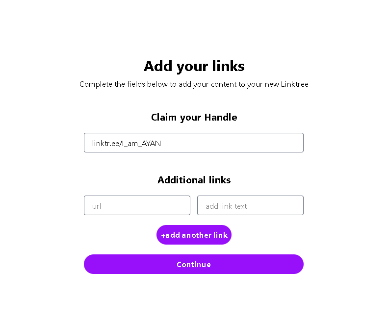

# Linktree Clone 🌿

A simple Linktree clone built with **Next.js 15 (App Router)**, **Tailwind CSS**, **MongoDB Atlas**, and deployed on **Vercel**.

This was built by me (Ayan) as an exercise to improve my full stack skills.  
In future, I plan to add:
- 🎨 Landing page animations
- ✏️ Edit profile & links feature
- 🌈 More customization options (themes, colors)

---

## 🚀 Features

✅ Claim a unique handle (like `linktr.ee/ayan`)  
✅ Add multiple custom links with descriptions  
✅ Upload profile picture & bio  
✅ Data stored in MongoDB Atlas   
✅ Deployed on Vercel

---

## 🔥 Screenshots

| Home page           |   Your personal Linktree page                  |
|-------------------------------------------|------------------------------------------|
|  |  |

|           ADD Links page   | Edit bio Display Name and upload pic page                    |
|-------------------------------------------|------------------------------------------|
|  |  |

---

## 🛠 Tech Stack

- **Frontend:** Next.js (App Router), Tailwind CSS
- **Backend:** Next.js API Routes
- **Database:** MongoDB Atlas
- **Deployment:** Vercel

---

## 🚀 Local setup

1. Clone the repo
```bash
git clone https://github.com/Ayan1024/Link-tree_clone.git
cd Link-tree_clone


This is a [Next.js](https://nextjs.org) project bootstrapped with [`create-next-app`](https://github.com/vercel/next.js/tree/canary/packages/create-next-app).

## Getting Started

First, run the development server:

```bash
npm run dev
# or
yarn dev
# or
pnpm dev
# or
bun dev
```

Open [http://localhost:3000](http://localhost:3000) with your browser to see the result.

You can start editing the page by modifying `app/page.js`. The page auto-updates as you edit the file.

This project uses [`next/font`](https://nextjs.org/docs/app/building-your-application/optimizing/fonts) to automatically optimize and load [Geist](https://vercel.com/font), a new font family for Vercel.

## Learn More

To learn more about Next.js, take a look at the following resources:

- [Next.js Documentation](https://nextjs.org/docs) - learn about Next.js features and API.
- [Learn Next.js](https://nextjs.org/learn) - an interactive Next.js tutorial.

You can check out [the Next.js GitHub repository](https://github.com/vercel/next.js) - your feedback and contributions are welcome!

## Deploy on Vercel

The easiest way to deploy your Next.js app is to use the [Vercel Platform](https://vercel.com/new?utm_medium=default-template&filter=next.js&utm_source=create-next-app&utm_campaign=create-next-app-readme) from the creators of Next.js.

Check out our [Next.js deployment documentation](https://nextjs.org/docs/app/building-your-application/deploying) for more details.
